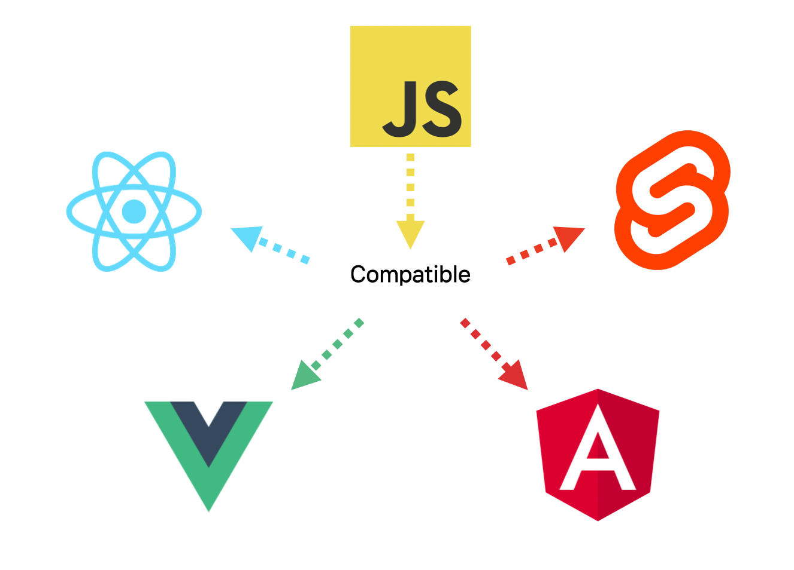
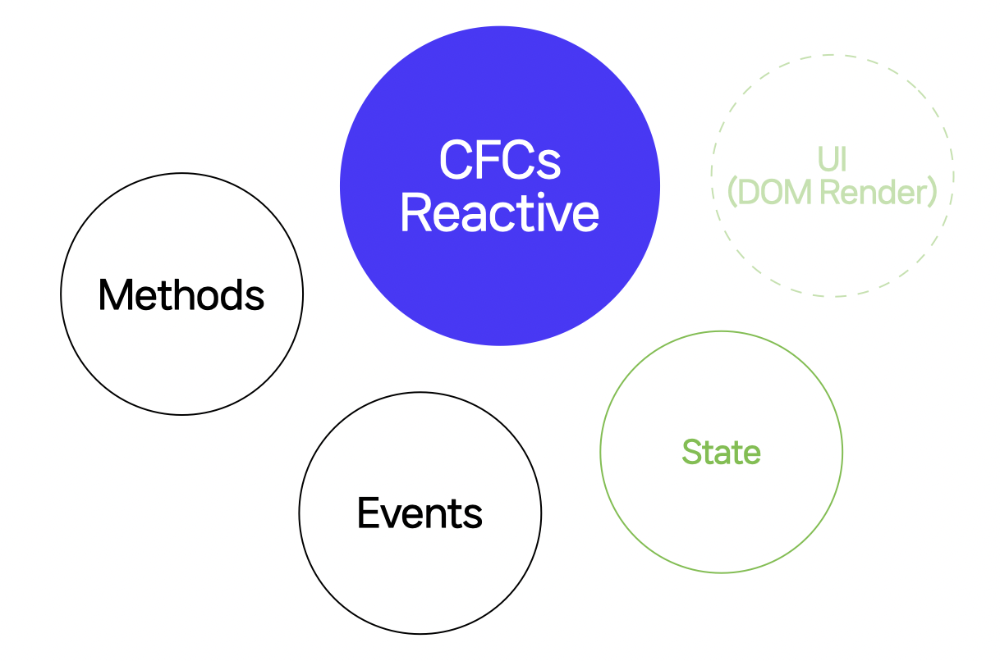

<p align="center"></p>

<h2 align="center" style="max-width: 100%;">
  <br/>
  <a href="#">Cross Framework Components</a>
</h2>

<p align="center">Write once, create framework components that supports React, Vue, Svelte, and more.</p>


<p align="middle">
<a href="https://www.npmjs.com/package/@cfcs/core" target="_blank"></a>&nbsp;
&nbsp;
<a href="https://github.com/naver/cfcs/blob/main/LICENSE" target="_blank"></a>&nbsp;
</p>

<p align="center" style="line-height: 2;">
  <a href="https://github.com/naver/cfcs/tree/main/packages/react"></a>
  <a href="https://github.com/naver/cfcs/tree/main/packages/vue2"></a>
  <a href="https://github.com/naver/cfcs/tree/main/packages/vue3"></a>
  <a href="https://github.com/naver/cfcs/tree/main/packages/svelte"></a>
</p>

## Description

Many users use JavaScript frameworks and create or use components available in the framework.

However, if the component you want doesn't exist, you may have to find it externally or create it yourself.

Have you ever wanted to use Vanilla components in React or React components in Vue?

In order to support these JavaScript frameworks, the developers of JS libraries had to learn how to use each framework, and write and maintain code for each framework separately.

**CFCs**(Cross Framework Components) were developed to solve these problems.
With **CFCs**, **one code** can support multiple frameworks according to the framework's usage.

## Who should use this library?

In today's web front-end development, JavaScript frameworks have become very important.

The problem is that even though there are many great components, there are cases where JavaScript frameworks are not supported. Even newer JavaScript frameworks stand out even more.

Typically, you can call these libraries using the `mounted` lifecycle supported by frameworks, but often you won't be able to use some of their features or even use them at all.


For those who have had such experiences, we recommend using CFC.
In particular, we recommend **CFCs** if you:


1. **You want to develop a component to support various JavaScript frameworks.**
2. **You want to support an existing component to the JavaScript framework**


## Concepts
Previously, if you wanted to support different JavaScript frameworks, you had to write code for each one separately.

This meant that if you doubled the number of frameworks you wanted to support, the maintenance cost is also doubled.

With **CFCs**, you can use Compatible to support multiple frameworks with **just one code**.



### CFCs Reactive

**CFCs Reactive** can support multiple frameworks as a Reactive Component, a utility component that is state-based and does not create a UI.




**Reactive State** is a state that changes according to a specific condition.

You can detect state changes and also create a UI that changes based on conditions.


* [**See Reactive Documents**](https://github.com/naver/cfcs/blob/main/reactive.md)


#### CFCs Reactive-style components
* [ImReady](https://github.com/naver/egjs-imready): I'm Ready to check if the images or videos are loaded.
* [Axes](https://github.com/naver/egjs-axes): You can easily create a UI that responds to user actions.
* [Conveyer](https://github.com/naver/egjs-conveyer): Drag gestures to your Native Scroll.


## 📦 Packages
|Package|Version|Description|
|:-----:|:-----:|:-----:|
|[**@cfcs/core**](https://github.com/naver/cfcs/blob/main/packages/core/README.md)|<a href="https://www.npmjs.com/package/@cfcs/core" target="_blank"></a>|CFCs for Core|
|[**@cfcs/react**](https://github.com/naver/cfcs/blob/main/packages/react/README.md)|<a href="https://www.npmjs.com/package/@cfcs/react" target="_blank"></a>|CFCs for [React](https://reactjs.org/)|
|[**@cfcs/vue2**](https://github.com/naver/cfcs/blob/main/packages/vue/README.md)|<a href="https://www.npmjs.com/package/@cfcs/vue2" target="_blank"></a>|CFCs for [Vue.js@2](https://vuejs.org/v2/guide/index.html)|
|[**@cfcs/vue3**](https://github.com/naver/cfcs/blob/main/packages/vue3/README.md)|<a href="https://www.npmjs.com/package/@cfcs/vue3" target="_blank"></a>|CFCs for [Vue.js@3](https://v3.vuejs.org/)|
|[**@cfcs/svelte**](https://github.com/naver/cfcs/blob/main/packages/svelte/README.md)|<a href="https://www.npmjs.com/package/@cfcs/svelte" target="_blank"></a>|CFCs for [Svelte](https://svelte.dev/)|


## 📝 Feedback
Please file an [Issue](https://github.com/naver/cfcs/issues).

## 📜 License
`cfcs` is released under the [MIT license](https://github.com/naver/cfcs/blob/main/LICENSE).

```
CFCs
Copyright (c) 2023-present NAVER Corp.

Permission is hereby granted, free of charge, to any person obtaining a copy
of this software and associated documentation files (the "Software"), to deal
in the Software without restriction, including without limitation the rights
to use, copy, modify, merge, publish, distribute, sublicense, and/or sell
copies of the Software, and to permit persons to whom the Software is
furnished to do so, subject to the following conditions:

The above copyright notice and this permission notice shall be included in
all copies or substantial portions of the Software.

THE SOFTWARE IS PROVIDED "AS IS", WITHOUT WARRANTY OF ANY KIND, EXPRESS OR
IMPLIED, INCLUDING BUT NOT LIMITED TO THE WARRANTIES OF MERCHANTABILITY,
FITNESS FOR A PARTICULAR PURPOSE AND NONINFRINGEMENT.  IN NO EVENT SHALL THE
AUTHORS OR COPYRIGHT HOLDERS BE LIABLE FOR ANY CLAIM, DAMAGES OR OTHER
LIABILITY, WHETHER IN AN ACTION OF CONTRACT, TORT OR OTHERWISE, ARISING FROM,
OUT OF OR IN CONNECTION WITH THE SOFTWARE OR THE USE OR OTHER DEALINGS IN
THE SOFTWARE.
```
