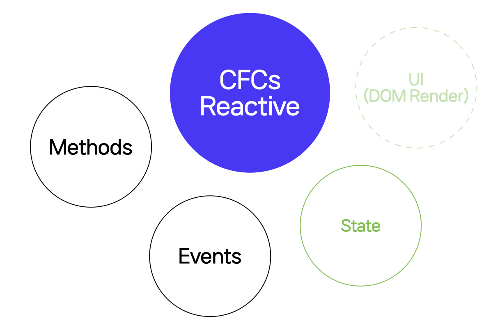

<h2 align="center" style="max-width: 100%;">
  <br/>
  <a href="#">Cross Framework Components Reactive</a>
</h2>


CFCs Reactive can support multiple frameworks as a Reactive Component, a utility component that is state-based and does not create a UI.



**Reactive State** refers to a state that changes according to a specific condition.

## 🏃 How to use

### ⚙️ Installation
```sh
$ npm install @cfcs/core
```

### Reactive State


`Reactive State` is a great extension for `Vanilla` as well.

Because you can get properties that can be obtained from events in one `Reactive State`.

If you can get properties through events you would use something like this:

```js
// AS-IS
inst.on("event1", e => {
  console.log(e.prop1);
});
inst.on("event2", e => {
  console.log(e.prop1);
});
```

If you want to directly detect the state value, you can use it in the following way.

```js
// TO-BE
inst.subscribe("prop1", nextValue => {
  console.log(nextValue);
});
```

In this case, state detection is more intuitive than event detection.


#### Class State
  * [`ReactiveSubscribe`](https://naver.github.io/cfcs/docs/api/Core/Reactive-Decorator/Function/ReactiveSubscribe) is a class decorator and adds `.subscribe` and `.unsubscribe` methods.
  * [`Observe`](https://naver.github.io/cfcs/docs/api/Core/Reactive-Decorator/Function/Observe) is a property decorator and converts the property into a `reactive state`. You can detect its status through `.subscribe`.
```ts
import { ReactiveSubscribe, Observe } from "@cfcs/core";

@ReactiveSubscribe
class Component {
  @Observe value1 = 1;

  constructor() {
    requestAnimationFrame(() => {
      this.value1 = 2;
    });
  }
}

interface Component extends ReactiveSubscribe<{
  value1: number;
  value2: number;
}> {}

const component = new Component();

// 1
console.log(component.value1);

component.subscribe("value1", nextValue => {
  // When the change event occurs => (2, 2)
  console.log(nextValue, component.value2);
});
```

### Inline Object State
  * [`reactive`](https://naver.github.io/cfcs/docs/api/Core/Reactive/Function/reactive) converts the object into a reactive object, and values can be changed through `.subscribe`.


```js
import { reactive } from "@cfcs/core";

const obj = reactive({
  value1: 1,
});


// 1
console.log(obj.value1);

obj.subscribe("value1", nextValue => {
  // When the change event occurs => (2, 2)
  console.log(nextValue, obj.value1);
});


obj.value1 = 2;
```


### Compatiable for Frameworks

Even if a vanilla component is created, it cannot be applied to the framework as it is. This is because the usage method is different for each framework.

So, to support vanilla components in the framework, CFCs provide compatible adapters.

CFCs provide several lifecycles and functions, and can be applied to various frameworks by writing usage accordingly.


* `created`: Lifecycle that occurs when a component is called (or created).
  * Initialize `state`, `methods`, and `events` to be exposed.
* `mounted`: Lifecycle that occurs when a component is mounted.
  * Connect the events exposed with the events of the instance.
* `init`: Lifecycle that occurs after registering an event in the mounted Lifecycle.
  * Initialize the instance.
* `destroy`: Lifecycle that occurs when a component is destroying.
  * Disconnect the exposed event and remove the instance.


### Write Reactive Adapter

Reactive Adapter is an intermediate stage code to support the framework.

If you can create an adapter, you can create a reactive component in the framework supported by CFCS.

It provides a reactive adapter in the form of a function, and you can complete the adapter by writing the code for the function.

The return value of Adapter returns `inline object state` or `class state` or void as an instance.
If void is returned, an instance can be set in the `mounted` lifecycle. See [`Use Lifecycle`](https://naver.github.io/cfcs/docs/best-practice/use-lifecycle).

```js
const REACTIVE_ADAPTER = () => {
};
```

[See Function Adapter's setup](https://naver.github.io/cfcs/docs/api/Core/Reactive/Interface/ReacitveSetup)

The following code is a simple example to introduce the relationship between Adapter and Frameworks. If you want to create CFCs Adapter, refer to the [Best Practice](https://naver.github.io/cfcs/docs/best-practice) document.

```ts
import { reactive } from "@cfcs/core";

const REACTIVE_ADAPTER = ({
  onMounted,
  onInit,
  onDestroy,
  emit,
  setEvents,
  setMethods,
}) => {
  // Set the event names to be exposed to the outside.
  setEvents(["change"]);
  // Set the method names to be exposed to the outside of the instance.
  setEvents(["method1"]);

  const obj = reactive({
    value1: 1,
    value2: 2,
    method1() {
      console.log("method1");
    },
  });

  const inst = new YourComponent();

  inst.on("change", e => {
    value1.current = 2;

    // emit `change` event externally
    emit("change", e);
  });

  onMounted(() => {
    // mounted hook
  });

  onInit(() => {
    // init hook
  });

  onDestroy(() => {
    // destroy hook
  });

  // Returns a reactive value.
  return obj;
};
```

### React
You can create a Reactive Component by importing the `@cfcs/react` module and using the `useReactive` function.


```sh
$ npm install @cfcs/react
```

```jsx
import { useReactive } from "@cfcs/react";

export function useReactiveComponent() {
  return useReactive(REACTIVE_ADAPTER);
}

export function App() {
  const {
    value1,
    value2,
    method1,
    onChange,
  } = useComponent();

  onChange(() => {
    // `change` event
  }, []);

  // `method1` method
  method1();
  return <div>{value1}x{value2}</div>;
}
```

### Vue 2 & 3
You can create a Reactive Component by importing the `@cfcs/vue3` (`@cfcs/vue2` in Vue 2) module and using the `useReactive` function.


```sh
# >= 2.7
$ npm install @cfcs/vue3
# < 2.7
$ npm install @cfcs/vue2
```

Use [`@vue/composition-api`](https://github.com/vuejs/composition-api) if you are going to use it in Vue 2.

```html
<template>
    <div>{value1}x{value2}</div>
</template>
<script>
// import { useReactive } from "@cfcs/vue2";
import { useReactive } from "@cfcs/vue3";

function useComponent() {
  return useReactive(REACTIVE_ADAPTER);
}

export default {
  setup() {
    const {
      value1,
      value2,
      onChange,
      method1,
    } = useComponent();

    onChange(() => {
      // `change` event
    });

    // `method1` method
    method1();
    return {
      value1,
      value2,
    };
  }
}
</script>
```
### Svelte
You can create a Reactive Component by importing the `@cfcs/svelte` module and using the `useReactive` function.


```sh
$ npm install @cfcs/svelte
```

```js
import { useReactive } from "@cfcs/svelte";

export function useComponent() {
  return useReactive(REACTIVE_ADAPTER);
}
```

```html
<script>
import { useReactive } from "./useComponent";

const {
  value1,
  value2,
  onChange,
  method1,
} = useComponent();

onChange(() => {
  // `change` event
});

// `method1` method
method1();
</script>
<div>{$value1}x{$value2}</div>
```


#### CFCs Reactive-style components
* [ImReady](https://github.com/naver/egjs-imready): I'm Ready to check if the images or videos are loaded.
* [Axes](https://github.com/naver/egjs-axes): You can easily create a UI that responds to user actions.
* [Conveyer](https://github.com/naver/egjs-conveyer): Drag gestures to your Native Scroll.
